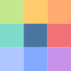

<p align="center">
  
</p>

<h1 align="center">Palette Provider</h1>

<p align="center">
  <strong>Extract intelligent color palettes from any image</strong>
</p>

<p align="center">
  <a href="https://dangervalentine.github.io/palette-provider">Live Demo</a>
</p>

<p align="center">
  
  
  
  
</p>

---

Palette Provider uses a **hybrid median-cut + k-means clustering** algorithm in the **OKLAB perceptually uniform color space** to extract professional-grade color palettes from images. Colors are automatically classified into dominant, supporting, and accent tiers.

## Features

**Extraction Modes**

| Mode | Behavior |
|------|----------|
| **Faithful** | Preserves natural color distribution weights from the image |
| **Design** | Enforces minimum perceptual distance, removing near-duplicates |
| **Complete** | Captures outlier colors missed by clustering for maximum coverage |

**Detail Levels** &mdash; Essential (4-6 colors), Balanced (8-12), or Rich (14-20)

**Eyedropper** &mdash; Long-press on the image to sample individual pixels with a live floating preview. Sampled colors are added to the palette in their own tier.

**Export** &mdash; Copy individual colors (HEX, RGB, HSL), copy all colors by tier, or download the palette as a labeled PNG sorted by hue.

**Theming** &mdash; Dark and light modes with system preference detection, built on the Night Owl color system.

## How It Works

```
Image ──► Stratified Grid Sampling (~10k pixels)
              │
              ▼
       RGB → OKLAB Conversion
              │
              ▼
       Median Cut (initial clusters)
              │
              ▼
       K-Means Refinement (5-10 iterations)
              │
              ▼
       Mode Post-Processing
       ├── Faithful: keep natural weights
       ├── Design: merge perceptually similar
       └── Complete: capture outliers
              │
              ▼
       Tier Classification
       ├── Dominant  (≥20% each, max 2)
       ├── Supporting (next 4, targeting 85% coverage)
       └── Accent    (remaining colors)
```

All clustering happens in OKLAB space for perceptually accurate distance calculations, then converts back to RGB for display.

## Quick Start

```bash
# Install
npm install

# Develop
npm run dev

# Test
npm test

# Build
npm run build

# Deploy to GitHub Pages
npm run deploy
```

## Tech Stack

- **React 19** &mdash; UI with hooks and refs
- **Vite 6** &mdash; Build tooling and dev server
- **Vitest** &mdash; Unit testing
- **OKLAB** &mdash; Perceptually uniform color space conversions
- **Canvas API** &mdash; Pixel sampling and palette image generation

## Project Structure

```
src/
├── App.jsx                 # Main app — image upload, state, layout
├── paletteEngine.js        # Extraction pipeline orchestrator
├── medianCut.js            # Median cut algorithm with detail configs
├── kmeans.js               # K-means clustering refinement
├── oklab.js                # RGB ↔ OKLAB conversions
├── tierClassifier.js       # Dominant/supporting/accent classification
├── colorUtils.js           # HEX, RGB, HSL format conversions
├── helpers.js              # Shared utilities
├── theme.js                # Dark/light mode management
│
├── Header.jsx              # Logo, title, theme toggle
├── Toolbar.jsx             # Mode, detail, format controls
├── Palette.jsx             # Color display grouped by tier
├── Swatch.jsx              # Individual color card with copy/remove
├── EyedropperPreview.jsx   # Floating preview during sampling
│
├── hooks/
│   ├── useEyedropper.js    # Long-press pixel sampling hook
│   └── useMediaQuery.js    # Responsive breakpoint detection
│
└── tokens.css              # Design tokens (Night Owl theme)
```

## License

MIT
