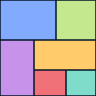
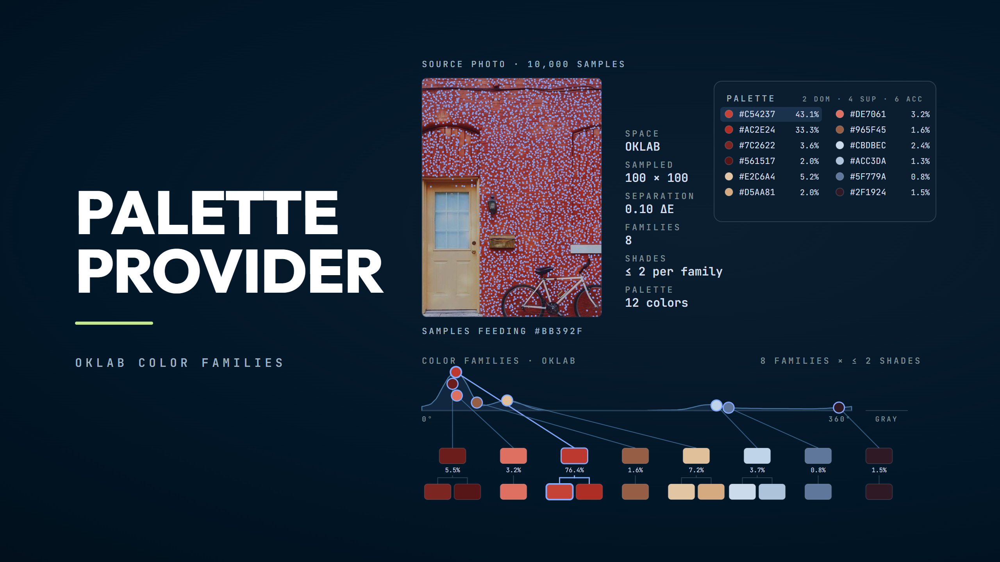
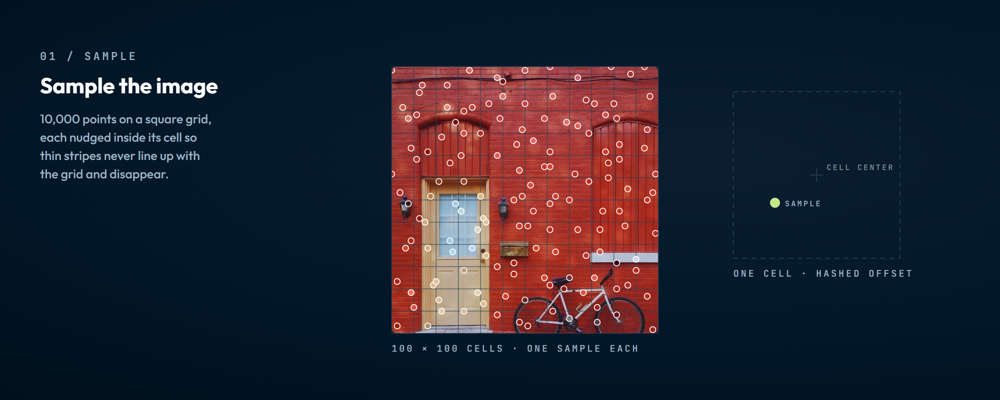
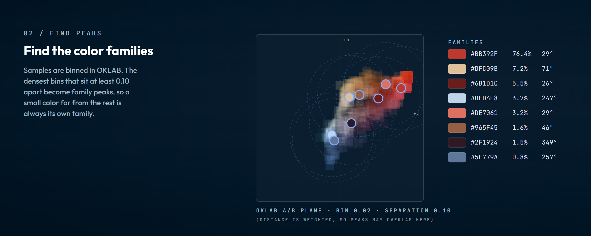
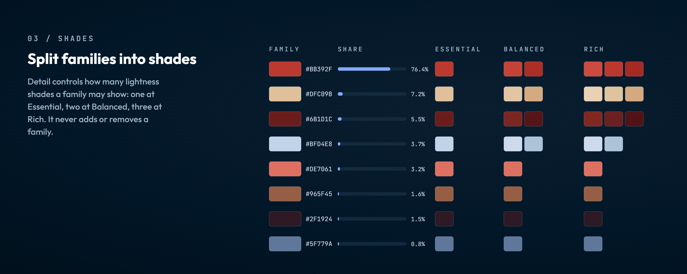
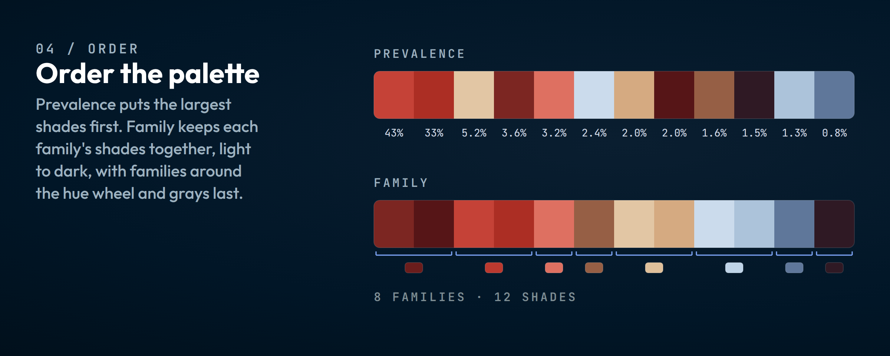

<p align="center">
  
</p>

<h1 align="center">Palette Provider</h1>

<p align="center">
  <strong>Extract intelligent color palettes from any image</strong>
</p>

<p align="center">
  <a href="https://dangervalentine.github.io/palette-provider">Live Demo</a>
</p>

<p align="center">
  <a href="https://dangervalentine.github.io/palette-provider">
    
  </a>
</p>

<p align="center">
  
  
  
  
</p>

---

Palette Provider finds the **color families** in an image as density peaks in the **OKLAB perceptually uniform color space**, so a small but distinct color (down to about 1% of the image) is not lost inside a large one. The app shows the palette next to the analysis behind it: how much of the image each family covers, where each family sits in color space, and which pixels fed it.

## Features

**Color Families** &mdash; Every perceptually distinct color in the image becomes a family with a faithful color and its true share, whether it covers 60% of the image or 2%.

**Detail Levels** &mdash; Essential (one shade per family), Balanced (up to two), or Rich (up to three). Detail adds depth within families; it never adds or removes families.

**Color Limit** &mdash; Show every color, or at most 8, 5, or 3 swatches. When the palette is over the limit, the closest families merge until their shades fit, so Detail decides how the swatches are spent: distinct colors at Essential, fewer colors in more shades at Rich. Lightness counts least when merging, so a vivid accent outlasts neutrals that differ only in brightness, and the larger family keeps its own color.

**Palette Strip** &mdash; Every color in one strip, ordered by **Prevalence** (largest shades first) or **Family** (each family's shades together, families around the hue wheel). Tap a color to copy it and select its family.

**Breakdown** &mdash; Each family as a bar as long as its share of the image, split into its shades, with every shade's value and share.

**Color Space** &mdash; The samples and family peaks on the OKLAB a/b plane, ringed by hue: the same plot as step 2 below, drawn from your own image.

**Sample Overlay** &mdash; Selecting a family marks the sample points that joined it on the source image, so you can see where a color came from.

**Eyedropper** &mdash; Long-press on the image for a live floating preview of the pixel under your finger; release to copy its value. The eyedropper reads colors; it does not change the palette.

**Export** &mdash; Copy individual colors (HEX, RGB, HSL), copy all colors in strip order, or download the palette as a labeled PNG in strip order.

**Theming** &mdash; Dark and light modes with system preference detection, built on the Night Owl color system.

## How It Works

<p align="center">
  
</p>
<p align="center">
  
</p>
<p align="center">
  
</p>
<p align="center">
  
</p>

```
Image ──► Stratified Grid Sampling (~10k pixels, jittered)
              │
              ▼
       RGB → OKLAB Conversion
              │
              ▼
       Density Map (sparse 3D histogram)
              │
              ▼
       Family Peaks (densest bins ≥ 0.10 apart, lightness weighted)
       └── every pixel joins its nearest family
              │
              ▼
       Shades per Family (by lightness, for every Detail level)
              │
              ▼
       Order
       ├── Prevalence (every shade by its share)
       └── Family     (families around the hue wheel, grays last;
                       shades light to dark)
```

The whole analysis runs once per image. Changing Detail picks a different set of precomputed shades, so it is instant.

All clustering happens in OKLAB space for perceptually accurate distance calculations, then converts back to RGB for display.

## Quick Start

```bash
# Install
npm install

# Develop
npm run dev

# Test
npm test

# Build
npm run build

# Regenerate the README art from art/ (uses Chrome; set CHROME_PATH
# to use another Chromium build)
npm run art:capture

# Deploy to GitHub Pages
npm run deploy
```

## Tech Stack

- **React 19** &mdash; UI with hooks and refs
- **Vite 6** &mdash; Build tooling and dev server
- **Vitest** &mdash; Unit testing
- **OKLAB** &mdash; Perceptually uniform color space conversions
- **Canvas API** &mdash; Pixel sampling and palette image generation

## Project Structure

```
src/
├── App.jsx                 # Main app — image upload, state, layout
├── paletteEngine.js        # Analysis pass and palette for a Detail level
├── densityPeaks.js         # Color families as density peaks in OKLAB
├── shades.js               # Lightness shades within a family
├── paletteOrder.js         # Prevalence and Family strip orders
├── oklab.js                # RGB ↔ OKLAB conversions
├── colorUtils.js           # HEX, RGB, HSL format conversions
├── helpers.js              # Shared utilities
├── theme.js                # Dark/light mode management
│
├── Header.jsx              # Logo, title, theme toggle
├── Toolbar.jsx             # Detail and format controls
├── ResultPanel.jsx         # Palette strip, order, and view tabs
├── Breakdown.jsx           # Families by share, split into shades
├── ColorSpace.jsx          # OKLAB a/b plot for the current image
├── SampleOverlay.jsx       # Selected family's samples on the image
├── EyedropperPreview.jsx   # Floating preview during sampling
│
├── viz/
│   ├── colorSpace.js       # a/b plot, shared with the README art
│   └── svg.js              # SVG element helpers
│
├── hooks/
│   ├── useEyedropper.js    # Long-press pixel preview and copy
│   └── useMediaQuery.js    # Responsive breakpoint detection
│
└── tokens.css              # Design tokens (Night Owl theme)
```

## License

MIT
